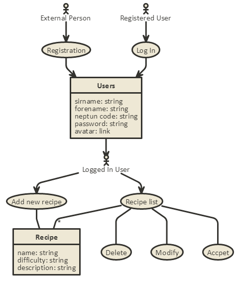
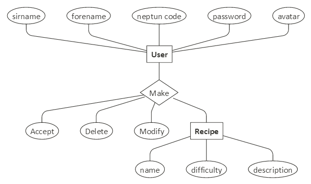
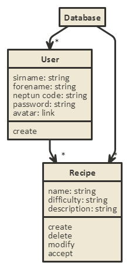

# Kollégiumi Recept Gyűjtemény
Alkalmazások Fejlesztése 1. beadandó - Kollégiumi recept gyűjtemény

## Követelményanalízis

### Funkcionális elvárások
**A programnak tartalmaznia kell:**
- legalább két modellt, egy-sok kapcsolatban
- legalább 1 űrlapot
- legalább 1 listázó oldalt
- legyen lehetőség új felvételére
- legyen lehetőség meglévő szerkesztésére
- legyen lehetőség meglévő törlésére
- legyenek benne csak hitelesítés után elérhető funkciók

### Nem funkcionális elvárások
- perzisztálás fájlba történjen
- közzététel Herokun

### Szerepkörök
- A honlap használatához regisztráció szükséges
- A regisztrált tagok beléphetnek, létrehozhatnak/módosíthatnak/törölhetnek recepteket

Egy recept törlésének pontos menete:
- A felhasználónak először regisztárlnia kell név, neptun kód, jelszó és avatar megadásával (az utolsó nem kötelező)
- Sikeres regisztrációt követően az oldal automatikusan belépteti
- A menüsor "Hozzáadás" elemére kattintva a felhasználó a "Recept Beküldése" oldalra kerül
- Itt a név, nehézség és leírás megadása után rögzítheti a receptjét
- A "Listázás" menüpontra kattintva a felhasználó láthatja a beküldött recepteket
- Itt megjelölheti, módosíthatja és törölehti az általa tesztelt recepteket a megfelelő gombokra kattintva
- Végül pedig a jobb felső sarokban lévő "Kilépés" gombra kattintva kijelentkezhet

## Tervezés

### Architektúra terv
- Oldaltérkép
  - [Kezdőlap](http://kollegiumi-recept-gyujtemeny.herokuapp.com/)
  - [Regisztráció](http://kollegiumi-recept-gyujtemeny.herokuapp.com/login/signup)
  - [Bejelentkezés](http://kollegiumi-recept-gyujtemeny.herokuapp.com/login/login)
  - [Receptek listája](http://kollegiumi-recept-gyujtemeny.herokuapp.com/list)
  - [Recept felvétele](http://kollegiumi-recept-gyujtemeny.herokuapp.com/add)
- Végpontok
  - /signup
  - /login
  - /logout
  - /list
  - /recipe/{id}
  - /add

### Felhasználói felület:

### Osztálymodell
- Adatmodell

- Állapotdiagram

## Implementáció

### Fejlesztői környezet:
A programot a [Cloud 9](https://c9.io/) online fejlesztői környezetében készítettem el, NodeJS-ben.

### Könyvtárstruktúrában lévő mappák
- .tmp : Itt található az disk.db, ami program adatbázisaként szolgál
- docs/images : Ebben a mappában helyeztem el az ezen dokumentáció elkészítéséhez szükséges képi fájlokat
- models : Tartalmazza a user és a recipe egyedek modelljeit
- node_modules : A programhoz szükséges telepített addon-ok alapértelmezett mappája
- public : Minden oldal által felhasználható forráskódokat tartalmaz
- test : Itt kaptak helyet a tesztesetek (jelen esetben csak egy fájl)
- views/login : A bejelentkezéshez, illetve regisztrációhoz szükséges .hbs fájlok helye
- views/partials : Az online felület kisebb és gyakran állandó részegységeinek a mappája

## Tesztelés

A tesztesetek a "test" mappában lévő "create.test.js" fájlban kaptak helyet
Az itt lévő tesztek megnézik, hogy egy felhasználói regisztrációt követően:
- visszanyerhető-e annak minden adata és ezek megfelelnek-e a regisztrációnál megadottaknak.
- az adatbázisban bármikor megtalálhatóak és visszanyerhetőek-e a letárolt adatok
- rossz adatoknál hibát dob-e az oldal
- jó jelszóval történő authorizáció esetén enged-e belépni az oldal
- rossz jelszóval történő authorizáció esetén hibát jelez-e az oldal

## Felhasználói dokumentáció
### Menü
A menüsor a betöltött oldal tetején kapott helyet. Itt balról jobbra haladva az alábbiak láthatók:
- "Kollégiumi recept gyűjtemény" : Ez az oldal címe. Ide kattintva a főoldalra kerülünk
- "Listázás" : Csak bejelentkezett felhasználók számára elérhető. Ide kattintva megtekinthetjük az eddig beküldött recepteket
- "Hozzáadás" : Csak bejelentkezett felhasználók számára elérhető. Itt küldhetünk be új recepteket
- "Regisztráció" : Azok számára, akik még nem rendelkeznek felhasználói fiókkal (Bejelentkezés után eltűnik)
- "Bejelentkezés" : Azok számára, akik már regisztráltak az oldalra (Bejelentkezés után eltűnik)
- "Kilépés" : Csak bejelentkezett felhasználók láthatják. Erre kattintva kijelentkezhetnek.

### Regisztráció
Ezen a felületen regisztrálhatnak az új felhasználók.
A regisztrációhoz szükség van a személy alábbi adataira:
- Vezetéknév
- Keresztnév
- Neptun-kód
- Jelszó
- Avatar URL (opcionális, nem kötelező kitölteni)

A helyes kitöltést követően a "Submit" gombra kattintva elvégezhető a regisztráció, vagy a "Cancel" gombot használva törölhető az összes eddigi kitöltött mező.

### Bejelentkezés
A már regisztrált felhasználók itt jelentkezhetnek be, amihez szükség van az alábbiakra:
- Neptun-kód
- Jelszó

Az adatok helyes megadását követően a "Submit" gombra kattintva bejelentkezhetünk, vagy a "Cancel" gomb segítségével törölhetőek a mezőkbe írt bejelentekzési adatok.

### Listázás
Bejelentkezés után itt látható az eddigi összes beküldött recept.
Minden receptnek itt vannak az alábbi adatai:
- Beküldés ideje
- Recept neve
- Recept nehézsége
- Recept leírása
- Műveletek

Az oldal szerkezetileg két táblázatra van bontva:

Ha egy receptet valaki kipróbál és szerinte megfelelő a recept leírása, a zöld pipára kattintva a recept elfogadásra kerül. A recept a továbbiakban az alsó táblázatban fog megjelenni.

Viszont ha valaki új receptet ad a listához, vagy módosít egy receptet, akkor az a felső táblázatba kerül.

A kék gombra kattintva meg lehet nézni a receptet egy kényelmesebb felületen és szükség esetén módosítható is ugyanitt.

A piros gomb megnyomásával az adott recept törölhető.

### Hozzáadás
Bejelentkezés után új recepteket küldhetünk be ezen az oldalon.
Minden receptnek ki kell tölteni az alábbi adatait:
- Recept neve
- Recept elkészítésének folyamata
- Recept nehézsége

Ezen adatok kitöltését követően a zöld gombra kattintva beküldhetjük a receptet, míg a piros gombra kattintva törölhetjük az összes kitöltött mezőt.

